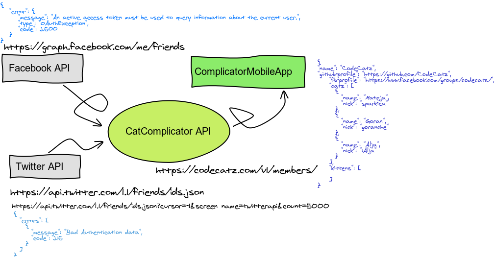

# JSON for CodeCatz

## J… what?
Data interchange format. Simple. Plain text. With curly braces.

{
	"name": "JSON",
	"nature": "kind",
	"type": "interchange format",
	"loved_by": ["web apps", "services"]
}

## What should I do with it?

## Try it!

Online JSON viewer: http://jsonviewer.stack.hu/

Copy/paste this:

{
"name": "CodeCatz",    
"github-profile": "https://github.com/CodeCatz",
    "fb-profile": "https://www.facebook.com/groups/codecats/",
    "catz": [
      {
        "name": "Mateja",
        "nick": "sparkica"
      },
      {
        "name": "Goran",
        "nick": "goranche"
      },
      {
        "name": "Alja",
        "nick": "iAlja"
      }
    ],
    "kittens": [
    ]
}

*Task*: Add yourself to the kittens in a similar way I added us three to cats.